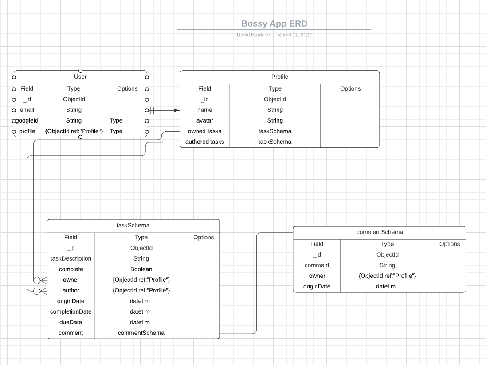

# Bossy

## Objective:

Welcome to Bossy! Bossy is a CRUD application that allows users to create tasks for your peers, complete tasks assigned to you. Stay productive - Have fun!

## To access the app click here
https://bossy-app.herokuapp.com/

## Motivation:

Bossy is tool designed to help boost productivity and focus. Accountability partner's provide checklist items to peers and keep others on track. Bossy is designed for those short-term more immediate task assignments; from partner lead workout plans, to dietary checklists or simply addressing those important tasks that always seem to get away from us from time to time. Bossy will track your progress and notify the assigning partner of your progress.

## Prototype View:

## ERD:

## Technology implemented:
- HTML5
- CSS3
- Javascript
- MongoDB
- ExpressJS
- Bootstrap

## User Experience:

David and Kim are part of a larger wine and cheese tasting club. David is out of town but didnt want to miss out on future tasting sessions. So Kim logged into Bossy and marked the check list items. David was able find the bottle and cheese at the store and leave a comment once it was completed.

